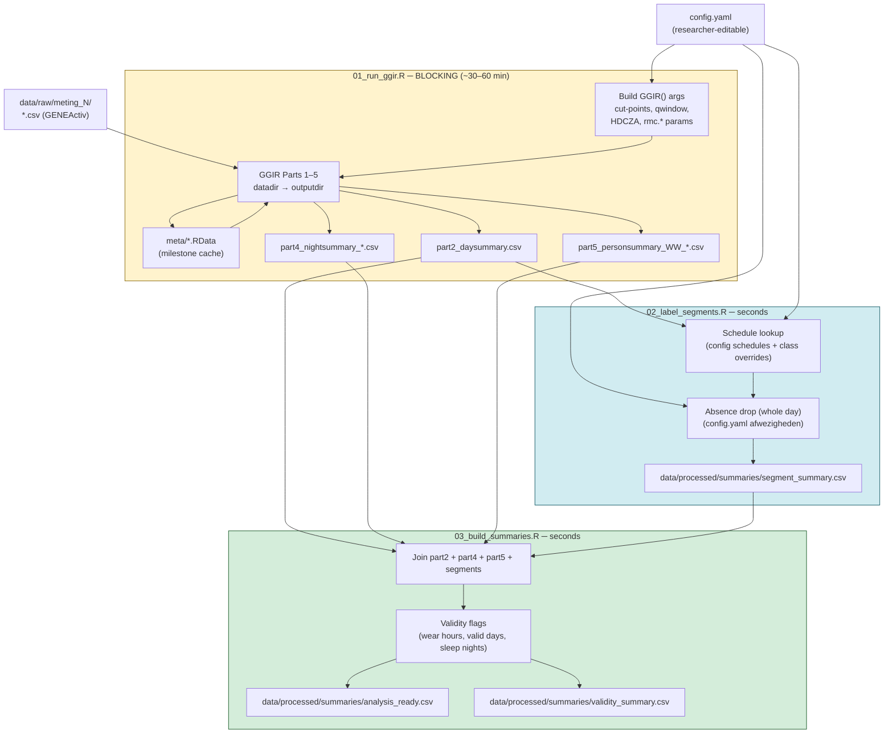
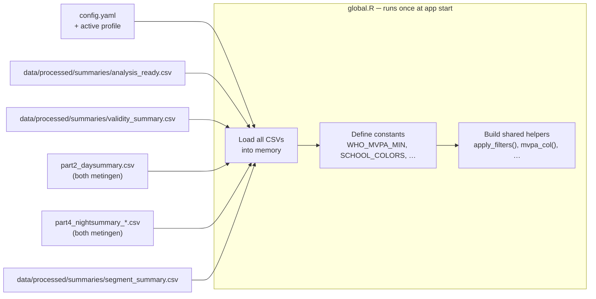
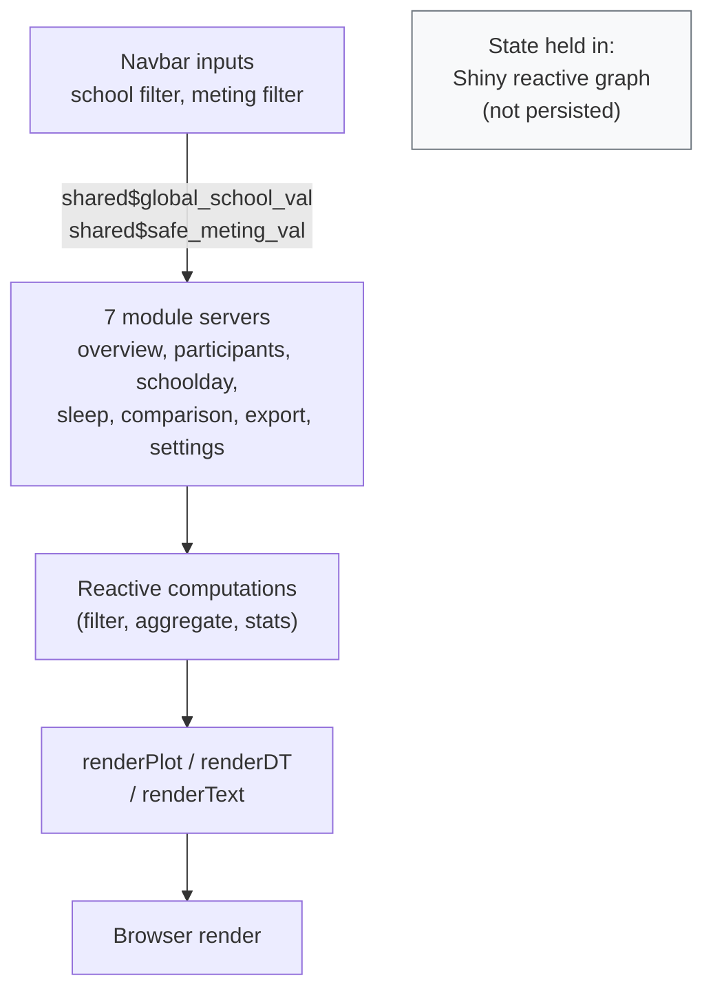

# SchoolMove — Architecture Reference

**Date:** 2026-05-04  
**Scope:** System architecture, state management, async handling, and full data flow from raw input to dashboard render

---

## System Architecture

SchoolMove is a **single-researcher, single-machine** R application. There is no server deployment, no authentication, no shared database, and no concurrent-user requirement. All state is file-based and local.

```
Researcher's machine
├── RStudio (pipeline execution)
│     └── pipeline/run_all.R  ← Rscript; runs GGIR + labeling + summaries
└── Browser (dashboard)
      └── shiny::runApp("shiny")  ← single R process; one session at a time
```

The pipeline and the dashboard are **deliberately separate processes**. The Shiny app never calls GGIR or modifies processed data — it only reads. This separation is load-bearing: GGIR Parts 1–5 on 400 participants can run 30–60 minutes. A synchronous call inside Shiny would freeze the UI for the full duration.

---

## State Management

### Pipeline state

All pipeline state is held in files on disk. No R environment persists between pipeline runs.

| State | Where | Written by | Read by |
|-------|-------|------------|---------|
| GGIR milestone files | `data/processed/meting_N/output_meting_N/meta/*.RData` | GGIR (Parts 1–4) | GGIR (Parts 2–5) |
| GGIR parameter record | `data/processed/meting_N/output_meting_N/config.csv` | GGIR | `read_ggir_config()`, archived to `logs/` |
| GGIR day summaries | `data/processed/meting_N/.../results/part2_daysummary.csv` | GGIR Part 2 | `02_label_segments.R`, `03_build_summaries.R`, `global.R` |
| GGIR sleep summaries | `data/processed/meting_N/.../results/part4_nightsummary_*.csv` | GGIR Part 4 | `03_build_summaries.R`, `global.R` |
| GGIR person summaries | `data/processed/meting_N/.../results/part5_personsummary_WW_*.csv` | GGIR Part 5 | `03_build_summaries.R` |
| Segment labels | `data/processed/summaries/segment_summary.csv` | `02_label_segments.R` | `03_build_summaries.R`, `global.R` |
| Analysis-ready table | `data/processed/summaries/analysis_ready.csv` | `03_build_summaries.R` | `global.R` |
| Validity flags | `data/processed/summaries/validity_summary.csv` | `03_build_summaries.R` | `global.R` |
| Absence registry | `config.yaml`'s `afwezigheden` list | Researcher (edits `config.yaml` directly) | `02_label_segments.R`, `02b_label_epochs.R`, `03_build_summaries.R` |
| Absence registry mirror (read-only) | `data/absences.csv` | `02_label_segments.R` (regenerated every run) | Nobody — researcher's own ad-hoc use only, never read back |
| Active config profile | `r/profiles/<name>.yaml` | Researcher (edits/adds YAML files directly — no dashboard UI) | `global.R` |
| Pipeline run log | `logs/pipeline_runs.csv` | `run_all.R` | `mod_export.R` (download) |
| Input manifest | `logs/input_manifest.csv` | `run_all.R` | `mod_export.R` (download) |

### Shiny state

Shiny state is loaded **once at startup** in `global.R` and held in R objects for the lifetime of the session. There are no per-session database queries, no lazy-loading, and no live file-watching. If the pipeline is re-run while the Shiny app is open, the dashboard must be restarted to pick up new data.

| Object | Type | Loaded from |
|--------|------|-------------|
| `cfg` | list | `config.yaml` + active profile |
| `analysis_ready` | data.table | `data/processed/summaries/analysis_ready.csv` |
| `validity_summary` | data.table | `data/processed/summaries/validity_summary.csv` |
| `part2` | data.table | `part2_daysummary.csv` (both metingen) |
| `part4` | data.table | `part4_nightsummary_*.csv` (both metingen) |
| `segment_summary` | data.table | `data/processed/summaries/segment_summary.csv` |

Reactive state (user-driven) is held in Shiny's reactive graph — school filter, meting filter, selected participant, active tab — and is not persisted across sessions.

---

## Async / Long-Running Tasks

**GGIR is not called from Shiny.** The "Run Pipeline" button (`btn_run_pipeline` in `server.R:70–96`) shows a modal with terminal instructions rather than executing GGIR. This is intentional and must not be "fixed" by adding a `system()` or `callr::r()` call.

**Why:** A synchronous GGIR call inside Shiny would block the entire R process for 30–60 minutes. No other interaction (tab switches, filter changes, downloads) would be possible during that time. There is no way to provide progress feedback or cancellation.

**Future path:** If async pipeline triggering is ever required, the correct approach is `ExtendedTask` (Shiny ≥ 1.8.1) or a `promises` + `callr::r_bg()` pattern — both keep the UI responsive while GGIR runs in a separate R process. This is a non-trivial addition; do not attempt it without a full feature plan.

---

## Data Flow

### Pipeline (terminal, one-shot)



**Blocking annotation:** Step 01 is the only long-running step. Steps 02 and 03 complete in seconds on 400 participants.

### Dashboard startup (Shiny `global.R`)



### Per-user interaction (reactive graph)



---

## Known Architectural Limitations

| Limitation | Impact | Mitigation |
|-----------|--------|------------|
| No live data refresh — Shiny must restart after pipeline re-run | Researcher must know to restart | Documented in GEBRUIKERSGIDS.md |
| GGIR not async — blocks if called from Shiny (never do this) | Pipeline runs in terminal only | "Run Pipeline" button shows modal with terminal command |
| `labeled_epochs.csv` never produced — context-aware bout detection is dead code | Bout columns in `analysis_ready` are always NA | Documented in AUDIT.md W6 + P2 |
| No unit tests — pure utility functions are untested | Regression risk before real-data run | AUDIT.md S3 |
