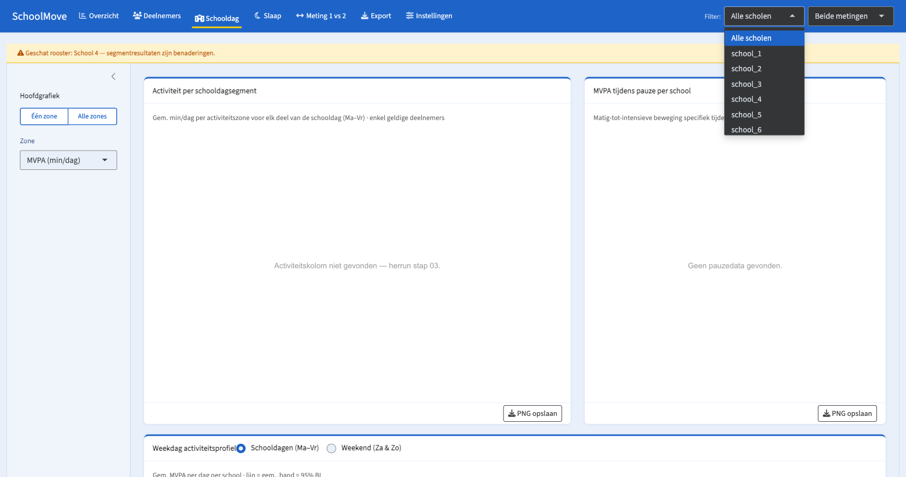
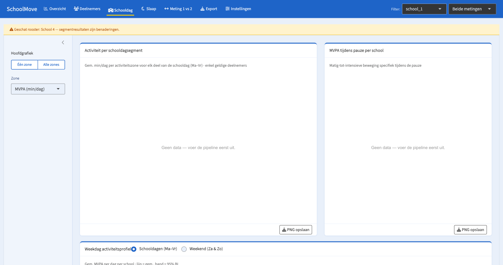
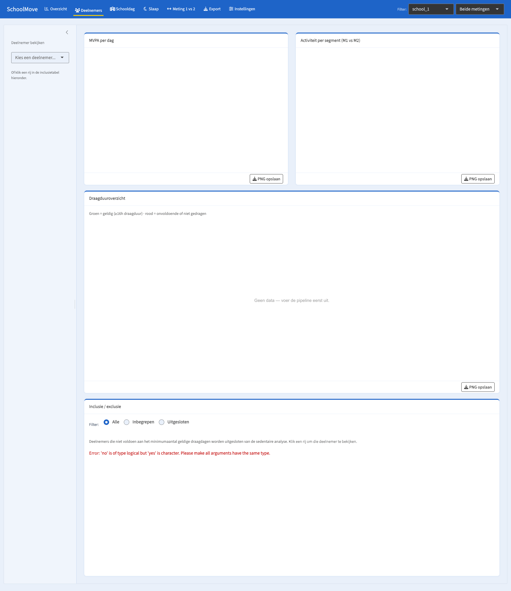
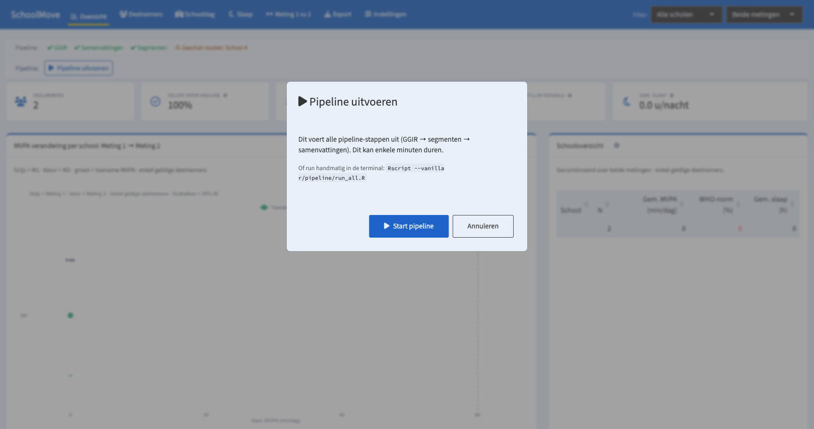
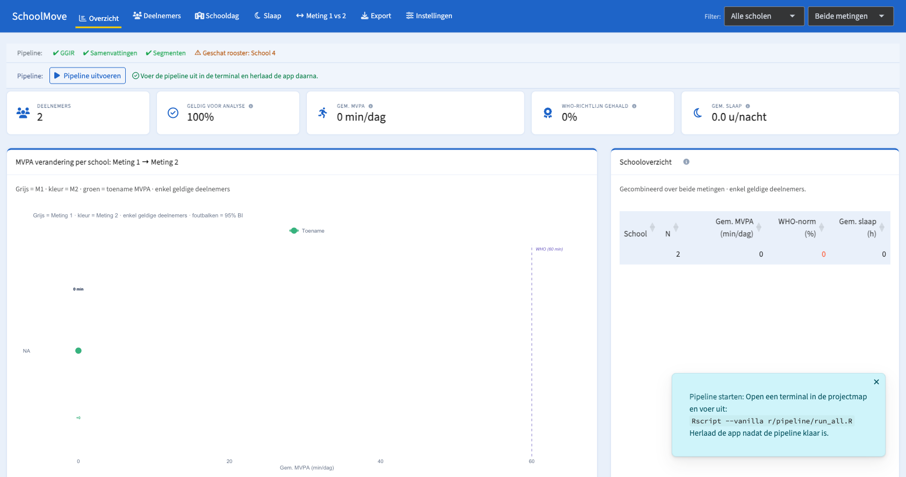
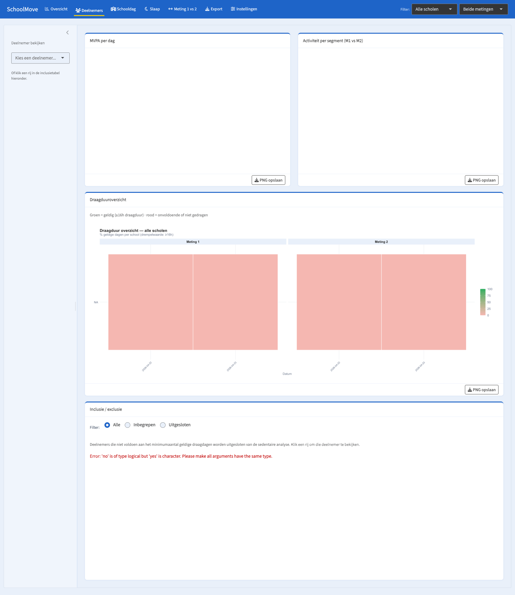
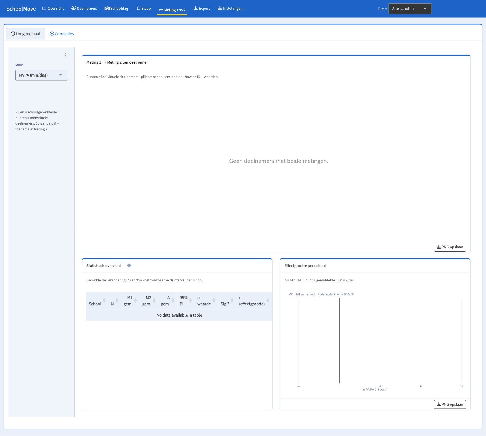
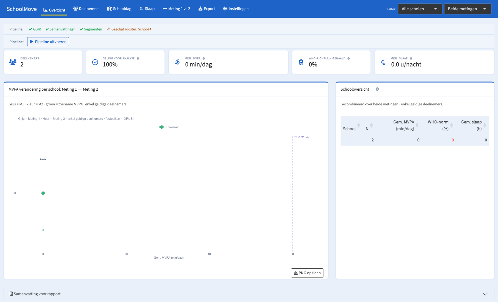
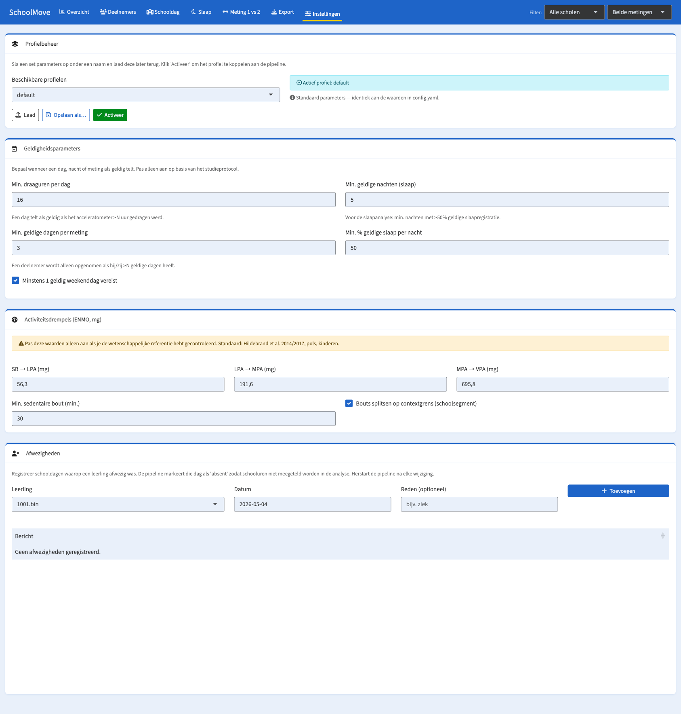
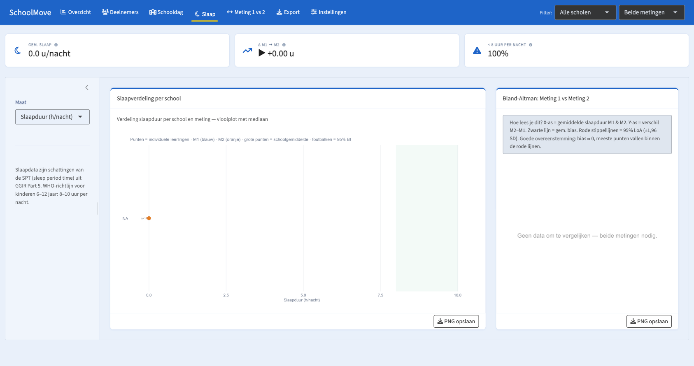

# SchoolMove — UI/UX Review

**Date:** 2026-05-04  
**Reviewer:** UX audit (post-structural review)  
**Method:** Playwright browser walkthrough on dummy data; source-trace for root-cause analysis  
**App version:** Dummy-data run; 2 participants ("1001.bin", "1002.cwa")  
**Scope:** All 7 tabs; navbar filters; pipeline modal; download flow

---

## Pre-Review Fix: App Does Not Start Without Patching

Before any UX walkthrough was possible, a critical startup bug prevented the app from loading at all. The fix was applied to `global.R` for review purposes and is documented as **U0** below.

---

## Summary Table

| ID | Severity | Category | Tab / Location | Description |
|----|----------|----------|----------------|-------------|
| U0 | 🔴 Critical | Startup | — | App fails to launch: module UI functions invisible to ui.R |
| U1 | 🔴 Critical | Functional | All tabs | School filter sends wrong values; all data disappears when a school is selected |
| U2 | 🔴 Critical | Functional | Deelnemers | Raw R error shown in Inclusie/exclusie table |
| U3 | 🟡 High | Data | All tabs | `school_NA` in data — dummy IDs with `.bin`/`.cwa` extensions break school extraction |
| U4 | 🟡 High | UX | Overzicht | "Start pipeline" button does nothing but signals success with a green checkmark |
| U5 | 🟡 High | UX | Deelnemers | Two empty-state charts show blank white space with no placeholder when no participant selected |
| U6 | 🟡 High | UX | Schooldag | Inconsistent empty-state messages: technical vs. user-friendly phrasing |
| U7 | 🟡 Medium | Localization | Meting 1 vs 2 | DataTables "No data available in table" message in English |
| U8 | 🟡 Medium | UX | Overzicht | Duplicate legend in MVPA dumbbell chart |
| U9 | 🟢 Low | UX | Instellingen | Participant dropdown shows "1001.bin" — raw filename with extension |
| U10 | 🟢 Low | UX | Overzicht / pipeline | Pipeline modal understates GGIR runtime ("enkele minuten" vs. 30–60 min) |
| U11 | 🟢 Low | UX | Slaap | "▶ +0.00 u" — play-triangle icon used as no-change direction indicator |

---

## Critical Issues

### U0 — 🔴 App does not start out of the box

**Symptom:** `shiny::runApp("shiny")` fails immediately with:
```
Warning: Error in modOverviewUI: could not find function "modOverviewUI"
```

**Root cause:** Module files are `source()`d with `local = TRUE` at the top of `server.R` (lines 7–14). `local = TRUE` places the defined functions in a temporary child environment, not in the global environment. Shiny evaluates `ui.R` before `server.R`, so when `ui.R` calls `modOverviewUI("overview")`, the function does not yet exist anywhere on the search path.

A secondary issue: `chart_card()`, `kpi_strip_card()`, `tip()`, and `fallback_banner()` are defined in `ui.R` but called at module-definition time inside the module files. This creates a circular dependency: modules need helpers that are only defined in ui.R, but ui.R needs modules that are not yet loaded.

**Temporary fix applied for this review:** Added module source calls (with `local = FALSE`) and duplicated the four UI helper definitions into `global.R` before the module sources. The `global.R` additions are clearly commented as a bug fix.

**Permanent fix (application code):**
1. Move all `source("modules/mod_*.R")` calls to `global.R`, without `local = TRUE`
2. Move `chart_card()`, `kpi_strip_card()`, `tip()`, `fallback_banner()` from `ui.R` to a new file (e.g., `shiny/utils/ui_helpers.R`) and `source()` it in `global.R`
3. Remove the duplicate definitions from `ui.R`

**Category:** ⚡ Quick win (15 min — move source calls, extract helpers to a file)

**Screenshot:** Not applicable — app produced a blank page with console error before fix.

---

### U1 — 🔴 School filter shows internal IDs and breaks filtering

**Symptom:** The "Filter:" dropdown in the navbar shows `school_1`, `school_2`, …, `school_6` instead of "School 1", "School 2", …, "School 6". Selecting any school causes ALL chart data to disappear.





**Root cause — display:** `SCHOOL_LABELS` in `global.R` is constructed as:
```r
SCHOOL_LABELS <- setNames(paste("School", seq_along(schools)), schools)
# Produces: names = "school_1", "school_2", ...; values = "School 1", "School 2", ...
```
In Shiny's `selectInput`, the **names** of the choices vector are displayed, and the **values** are what `input$global_school` receives. So the dropdown shows "school_1" (the name) and sends "School 1" (the value) to the server.

**Root cause — filtering broken:** The `school` column in `analysis_ready.csv` and `segment_summary.csv` contains "school_1", "school_2", etc. (internal identifiers). When the filter sends "School 1" to `apply_global_filters_pure()`, the comparison `dt[school == "School 1"]` returns zero rows.

**Fix (ui.R):**
```r
# In ui.R, change:
choices = c("Alle scholen" = "all", SCHOOL_LABELS)
# To:
choices = c("Alle scholen" = "all", setNames(names(SCHOOL_LABELS), SCHOOL_LABELS))
```
This displays the values ("School 1") and sends the names ("school_1") to the server — which matches the data column.

**Category:** ⚡ Quick win (5 min — one-line fix in ui.R)

---

### U2 — 🔴 Raw R error shown in Deelnemers inclusion table

**Symptom:** The Inclusie/exclusie table in the Deelnemers tab shows a raw R error in red text:
```
Error: 'no' is of type logical but 'yes' is character. Please make all arguments have the same type.
```



**Root cause:** `03_build_summaries.R` writes `validity_summary.csv` with an `exclusion_reason` column. When all participants are valid (as in dummy data), the column is entirely empty. `data.table::fread()` reads a fully-empty column as `logical` (all NA). In `mod_participants.R:244`:
```r
dt[, reden := fifelse(is.na(exclusion_reason), "—", exclusion_reason)]
```
`data.table::fifelse()` requires both branches to have the same type. Here, the `yes` branch is `"—"` (character) and the `no` branch is `exclusion_reason` (logical NA). The type mismatch throws the error.

**Fix (mod_participants.R line 244):**
```r
dt[, reden := fifelse(is.na(exclusion_reason), "—", as.character(exclusion_reason))]
```

**Category:** ⚡ Quick win (2 min — add `as.character()` cast)

---

## High-Priority Issues

### U3 — 🟡 `school_NA` in all processed data — dummy data ID parsing

**Symptom:** All rows in `analysis_ready.csv`, `validity_summary.csv`, and `segment_summary.csv` have `school = "school_NA"`. School labels are blank in the Schooloverzicht table (Overzicht tab) and in chart axis labels.

**Root cause:** `extract_school_id()` in `02_label_segments.R:32` strips `.csv` extensions before integer-parsing the ID, but not `.bin` or `.cwa`:
```r
code <- suppressWarnings(as.integer(sub("\\.csv$", "", basename(as.character(id)))))
paste0("school_", code %/% 1000L)
```
The example data files are `1001.bin` and `1002.cwa`. After `sub("\\.csv$", ...)`, the string remains "1001.bin". `as.integer("1001.bin")` returns NA → `paste0("school_", NA)` = "school_NA".

**Impact:** Even if U1 (filter bug) is fixed, filtering for any specific school still returns empty data because no row has school = "school_1" through "school_6".

**Fix (02_label_segments.R:33):**
```r
# Replace the sub() call with a generic extension stripper:
code <- suppressWarnings(as.integer(sub("\\.[^.]+$", "", basename(as.character(id)))))
```
This strips `.csv`, `.bin`, `.cwa`, and any other single extension.

**Category:** ⚡ Quick win (2 min — change the regex in 02_label_segments.R)

---

### U4 — 🟡 "Start pipeline" button implies execution but does nothing

**Symptom:** The pipeline bar shows an "Pipeline uitvoeren" button. Clicking it opens a modal with a "Start pipeline" primary button. Clicking "Start pipeline" closes the modal and shows a green ✔ status message: "Voer de pipeline uit in de terminal en herlaad de app daarna." — but nothing has actually been executed.





**Issues:**
1. Button label "Start pipeline" is false — it does not start anything. The researcher will click it expecting something to happen, then be confused by the toast notification.
2. The status message uses a green ✔ icon, which conventionally means "completed successfully". It should use a neutral icon (e.g., ℹ) and neutral color (grey or blue).
3. The modal body says "Dit kan enkele minuten duren" — GGIR on 400 participants takes **30–60 minutes**, not "a few minutes".
4. The terminal command `Rscript --vanilla r/pipeline/run_all.R` is shown without specifying the required working directory (repo root). Veerle would need to know to `cd` to the project root first.

**Fixes:**
```r
# server.R line 77: rename button
actionButton("btn_pipeline_confirm", "Toon instructies",
             icon = icon("terminal"), class = "btn-outline-primary")

# server.R line 73: correct duration estimate  
p("GGIR verwerking kan 30–60 minuten duren op de volledige dataset.")

# server.R line 88: use neutral icon for post-confirm status
pipeline_result(list(ok = TRUE,
  msg = "Voer de pipeline uit in de terminal en herlaad de app daarna."))
# Change icon from "circle-check" to "circle-info" and color from green to #6c757d

# server.R line 92: add working directory
tags$code("cd /pad/naar/veerleproject && Rscript --vanilla r/pipeline/run_all.R")
```

**Category:** ⚡ Quick win (15 min — label + icon changes)

---

### U5 — 🟡 Empty participant charts show blank white space

**Symptom:** In the Deelnemers tab, when no participant has been selected, the "MVPA per dag" and "Activiteit per segment (M1 vs M2)" chart cards show completely blank white areas — no placeholder message, no instructions.



**Expected behavior:** A subtle "Selecteer een deelnemer om data te tonen" message inside the plot area, identical to the `no_data_plot()` pattern used in other tabs.

**Fix (mod_participants.R):** Both renderPlot blocks for the explorer charts should start with:
```r
req(nzchar(input$explorer_id))
```
or return `no_data_plot("Selecteer een deelnemer hierboven of in de tabel.")` when `input$explorer_id` is empty.

**Category:** ⚡ Quick win (5 min per chart — add req() guard)

---

### U6 — 🟡 Inconsistent empty-state messages across tabs

**Symptom:** Different charts use different phrasing when there is no data, mixing technical pipeline references with user-friendly messages:

| Location | Message |
|----------|---------|
| Schooldag → Activiteit per segment | "Activiteitskolom niet gevonden — herrun stap 03." |
| Schooldag → Pauze MVPA | "Geen pauzedata gevonden." |
| Schooldag → Weekdag profiel | "Geen data — voer de pipeline eerst uit." |
| Vergelijking → Slopegraph | "Geen deelnemers met beide metingen." |
| Correlaties | "Te weinig datapunten." |

"Herrun stap 03" is meaningless to Veerle — she doesn't know pipeline step numbers.

**Fix:** Standardise messages in all modules to avoid internal step references:
- Replace "herrun stap 03" → "Segmentdata ontbreekt — herlaad na het opnieuw draaien van de volledige pipeline."
- Define a small lookup in `util_plots.R`: `no_data_msg(reason)` that returns a consistent Dutch phrase.

**Category:** ⚡ Quick win (20 min — grep and replace message strings)

---

## Medium-Priority Issues

### U7 — 🟡 DataTables empty message is in English

**Symptom:** In the Vergelijking → Longitudinaal sub-tab, the Statistisch overzicht table shows the English DT default: "No data available in table".



**Fix (mod_comparison.R):** Add a `language` option to every `datatable()` call:
```r
datatable(..., options = list(
  language = list(emptyTable = "Geen data beschikbaar."),
  ...
))
```
This needs to be applied across all `datatable()` calls in all modules.

**Category:** ⚡ Quick win (30 min — grep for `datatable(` and add language option)

---

### U8 — 🟡 Duplicate legend in Overzicht MVPA dumbbell chart

**Symptom:** The MVPA-verandering chart on the Overzicht tab shows the legend twice: once as a manually written subtitle paragraph ("Grijs = M1 · kleur = M2 · groen = toename MVPA…"), and again inside the ggplot legend area. The two legends use different ordering.



**Fix (mod_overview.R):** Remove the manual subtitle paragraph and keep only the in-chart ggplot legend, or vice versa. The in-chart legend is more precise; the manual subtitle can be removed.

**Category:** ⚡ Quick win (5 min — remove one subtitle)

---

## Low-Priority Issues

### U9 — 🟢 Absence dropdown shows raw filename with extension

**Symptom:** The Leerling dropdown in Instellingen → Afwezigheden shows "1001.bin" instead of "1001".



**Fix (mod_settings.R):** Strip the extension when populating the choices:
```r
choices = sort(tools::file_path_sans_ext(unique(ids)))
```

**Category:** ⚡ Quick win (5 min)

---

### U10 — 🟢 Pipeline modal understates GGIR runtime

**Symptom:** `server.R:73` says "Dit kan enkele minuten duren" (a few minutes). On the full 400-participant dataset, GGIR Parts 1–5 typically runs 30–60 minutes.

**Fix:** Change the copy to "GGIR verwerking duurt typisch 30–60 minuten op de volledige dataset."

**Category:** ⚡ Quick win (1 min)

---

### U11 — 🟢 Play-triangle icon used as neutral-change indicator in Slaap KPI

**Symptom:** The "Δ M1→M2" KPI on the Slaap tab shows "▶ +0.00 u" — the ▶ play icon is used to indicate no directional change.



**Fix (mod_sleep.R):** Use `icon("minus")` or "→" for zero change, `icon("arrow-up")` for increase, `icon("arrow-down")` for decrease.

**Category:** ⚡ Quick win (10 min)

---

## Positive Findings

The following elements are implemented well and should be preserved:

- **Data readiness strip** — The coloured ✔/✗/⚠ checks at the top of Overzicht immediately tell researchers what pipeline steps have run. Clear and actionable.
- **KPI card navigation** — Clicking a KPI card navigates to the relevant detail tab. Works correctly and is a nice progressive-disclosure pattern.
- **Fallback school banner** — The yellow warning for School 4 IS shown on the Schooldag tab (the one tab where it matters most).
- **Meting filter auto-hide** — The global meting filter correctly disappears on the Vergelijking tab (which always shows both metingen).
- **Export tab layout** — Three-column grouping (GGIR raw / Analysis / Filtered) with "Beschikbaar" badges is clear and scannable. Downloads produce correctly timestamped filenames.
- **Instellingen protective copy** — The warning "Pas deze waarden alleen aan als je de wetenschappelijke referentie hebt gecontroleerd" on the cut-points accordion prevents accidental overrides.
- **Bland-Altman empty state** — "Geen data om te vergelijken — beide metingen nodig" is an exemplary empty-state message: specific, actionable, user-friendly.
- **Rapport samenvatting** — Auto-generated copyable text is a strong researcher-productivity feature.
- **Shimmer loading animation** — CSS shimmer on recalculating plots gives responsive feedback during reactive updates.

---

## Visual Design Notes

- **Contrast:** All text/background combinations pass WCAG AA (UGent blue #1E64C8 on white, white text on #1E64C8).
- **Font size:** 15px base, 0.82–0.88rem for secondary elements. Comfortable for desktop use; no mobile work needed for this use case.
- **Spacing:** Card gap of 1.1rem and padding of 1rem is consistent. No crowding.
- **Active tab indicator:** UGent yellow underline on active tab is consistent with the UGent styleguide and visually distinct.
- **Sidebar collapse:** The `<` collapse button on layout_sidebar panels works but has low affordance — unclear it is clickable. A labelled "Verberg / Toon" toggle would be more discoverable.

---

## Prioritised Fix List

| Priority | Fix | Effort | Impact |
|----------|-----|--------|--------|
| 1 | U0 — Move module sources to global.R | 15 min | App doesn't run without this |
| 2 | U1 — Fix SCHOOL_LABELS in selectInput | 5 min | All school filtering broken |
| 3 | U2 — Cast exclusion_reason to character | 2 min | Visible error in Deelnemers |
| 4 | U3 — Strip any extension in extract_school_id | 2 min | All school data is "school_NA" |
| 5 | U4 — Rename "Start pipeline" button | 15 min | Misleading user expectation |
| 6 | U5 — Add req() guard on explorer plots | 5 min | Blank white cards |
| 7 | U6 — Standardise empty-state messages | 20 min | Technical jargon visible to Veerle |
| 8 | U7 — Add DT language option | 30 min | English in Dutch UI |
| 9 | U8 — Remove duplicate chart legend | 5 min | Minor visual noise |
| 10 | U9–U11 — Small label/icon fixes | 20 min | Polish |
